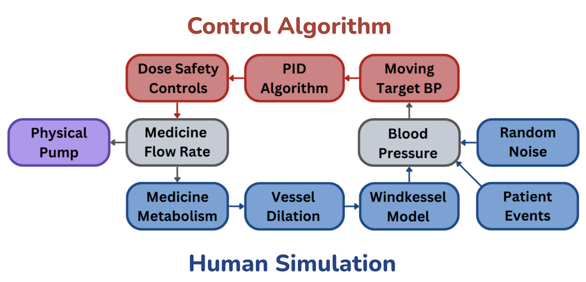

# Blood Pressure Simulation and Regulation System

This project focuses on simulating and regulating blood pressure using automated control systems. The study explores the use of a Proportional-Integral-Derivative (PID) control algorithm to regulate blood pressure in hypertensive patients. It models blood pressure dynamics, compares control versus treatment groups, and evaluates the effectiveness of autonomous regulation systems in achieving and maintaining target blood pressure levels.

## `unified_bp_simulation.py` Overview

The `unified_bp_simulation.py` script is the main implementation of the simulation and regulation system. It models the blood pressure dynamics for a group of patients using both untreated control group simulations and a PID-regulated treatment group. Below is an outline of the key steps in the script:



## Algorithm Steps (see unified_bp_simulation.py)

### 1. **Generate Blood Pressure Profiles**
   - Blood pressure profiles are created to mimic real-world patient conditions, including phases of sustained pressures, sudden spikes, and dips.
   - These profiles represent the natural variability of BP without intervention, providing the foundation for both control and treatment simulations.

### 2. **Initialize Simulation Parameters**
   - The simulation includes:
     - **Number of patients**: 20 simulated patients.
     - **Simulation time**: 11,000 seconds (approximately 3 hours).
     - **Target BP**: 90 mmHg, with acceptable ranges of ±10 mmHg (control) and tighter ranges (e.g., ±1 mmHg) for further analysis.

### 3. **Simulate Control Group**
   - The control group represents patients without intervention. BP evolves according to the generated profiles, capturing the natural variability of hypertensive patients without treatment.

### 4. **Apply PID Control for Treatment Group**
   - The PID algorithm dynamically adjusts infusion rates based on deviations from the target BP.
   - The **Windkessel model** is used to simulate physiological BP responses to infusion, incorporating random noise for realism.

### 5. **Track Metrics**
   - Blood pressure values for both groups are logged at 1-second intervals.
   - Additional metrics include:
     - Time spent within and outside the target BP range.
     - Number of infusion rate adjustments.
     - Cumulative time each patient’s BP remains uncontrolled (outside the target range).

### 6. **Save Results**
   - Outputs a detailed CSV file (`simulation_results.csv`) with time-series data for BP and infusion rates for all patients.

### 7. **Visualize Results**
   - Generates a plot showing BP regulation for the treatment group, including:
     - Lower and upper target range lines.
     - BP trends for all patients over time.


- The results evaluate the PID control algorithm’s ability to maintain BP within the target range and minimize variability.


### How to Run the Script

Run the simulation with:
```bash
python unified_bp_simulation.py
